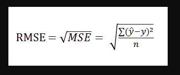

# 35개 도로의 시간별 교통량 예측
주최 : 중소벤처기업진흥공단 / 주관 : 마인즈앤컴퍼니 (MNC)

## 대회 개요
- **대회 기간** : 2022년 02월 16일 12:00 PM ~ 2022년 02월 22일 12:00 PM
- **문제 정의** : 35개 도로의 시간별 물류 통행량 데이터를 학습, 이를 기반으로 기준시점 이후 물류 통행량을 예측하는 과제
- **추진 배경**
	- 도시화, 밀집화에 따른 교통 혼잡도 예측의 중요성 증대
	- 자율 주행 고도화 및 효율화를 위한 전제 조건

- **평가 지표** 
	- **RMSE(Root Mean Square Error)**

----------
## 문제 접근방법

Train data의 feature는
#### 날짜(2020년 1월 1일- 2020년 5월 7일), 시간대(0-24), 교통량
3가지가 주어졌습니다. 

복잡한 시게열(Time Series) model을 써서 deep learning을 진행할 수 있지만,  
feature들의 갯수가 충분하지 않고, 외부 데이터 또한 적절한 것이 생각나지 않았습니다.  
오히려 EDA를 통해 데이터를 찬찬히 뜯어보니 결측치만 다뤄주면 linear한 model을 뽑을수 있지 않을까란 생각을 했습니다.

최종적으로 예측해야하는 값들은 1주일(월화수목금토일)의 24시간 동안 35개의 도로에 대해서 예측해야했습니다.

다음과 같이 예측한 근거는 이러합니다.
1. 교통량은 시기별로 크게 다르지 않을 것이다. (연휴제외)  
2. 같은 도로에 대하여 요일, 시간대별 교통량은 크게 변하지 않을 것이다.  
3. 예측해야 하는 기간에 연휴가 존재하지 않았다.  

따라서,Train data를 각 요일별(7) 그리고 도로별(35개), 마지막으로는 시간(24)별로 묶어  
Linear regression을 진행했습니다.

### 결과
public score: 3620,  
private score: 3623  
1위

---------
## 마무리
좋은 모델, 큰 모델을 다루는 것도 좋은 insight가 도출될 수 있지만, EDA과정이 매우 중요함을 깨달았습니다.  
문제에 접근할 때 "왜?"라는 질문에 답 할 수 있어야 한다고 생각합니다. 문제가 해결되는 방법이 하나가 아닐 수 있고,  
최선이 아닐 수 있기 때문입니다.
